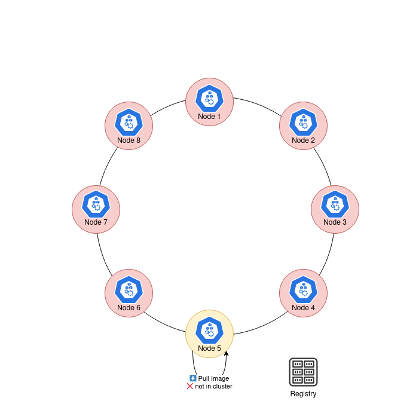
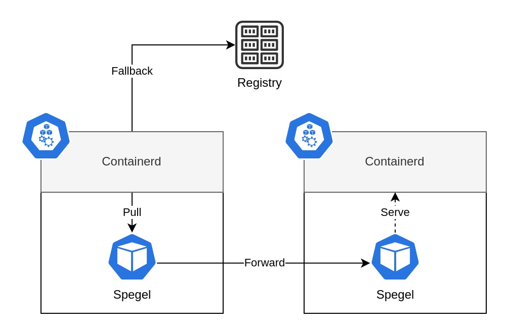

# Spegel

Spegel, mirror in Swedish, is a stateless cluster local OCI registry mirror.

## Background

Kubernetes does a great job at distributing workloads on multiple nodes. Allowing node failures to occur without affecting uptime. A critical component for this to work is that each node has to be able to pull the workload images before they can start. Each replica running on a node will incur a pull operation. The images may be pulled from geographically close registries within the cloud provider, public registries, or self-hosted registries. This process has a flaw in that each node has to make this round trip separately. Why can't the nodes share the image among themselves?

<p align="center">
  
</p>

Spegel enables all nodes in a Kubernetes cluster to act as a local registry mirror, allowing nodes to share images between themselves. Any image already pulled by a node will be available for any other node in the cluster to pull.

This has the benefit of reducing workload startup times and egress traffic as images will be stored locally within the cluster. On top of that it allows the scheduling of new workloads even when external registries are down.

## Prerequisite

Spegel relies on [containerd registry mirroring](https://github.com/containerd/containerd/blob/main/docs/hosts.md#cri) to route requests to the correct destination. It is capable of writing the mirror configuration on startup, as it is loaded on the fly by containerd.
It is however not capable of setting the registry mirror `config_path` in the containerd configuration as it requires a restart of containerd for the change to be picked up.

Spegel has been verified with AKS and EKS as they come with the expected configuration out of the box. Any other Kuberentes deployment should make the following configuration change to containerd.

```toml
version = 2

[plugins."io.containerd.grpc.v1.cri".registry]
   config_path = "/etc/containerd/certs.d"
```

## Installation

The easiest method to install Spegel is with Helm. Refer to the [Helm Chart documentation](./charts/spegel) for detailed configuration documentation.

```shell
helm upgrade --create-namespace --install --version v0.0.4 spegel oci://ghcr.io/xenitab/helm-charts/spegel
```

## Architecture

Spegel can run as a stateless application by exploiting the fact that an image pulled by a node is not immediately garbage collected. Spegel is deployed as a Daemonset on each node which acts as both the registry and mirror. Each instance is reachable both locally through a host port and a Service. This enables Containerd to be configured to use the localhost interface as a registry mirror and for Spegel instances to forward requests to each other.

<p align="center">
  
</p>

Images are composed of multiple layers which are stored as individual files on the node disk. Each layer has a digest which is its identifier. Every node advertises the digests which are stored locally on disk. Kademlia is used to enable a distributed advertisement and lookup of digests. An image pull consists of multiple HTTP requests with one request per digest. The request is first sent to Spegel when an image is pulled if it is configured to act as the mirror for the registry. Spegel will lookup the digest within the cluster to see if any node has advertised that they have it. If a node is found the request will be forwarded to that Spegel instance which will serve the file with the specified digest. If a node is not found a 404 response will be returned and Containerd will fallback to using the actual remote registry.

In its core Spegel is a pull only OCI registry which runs locally on every Node in the Kubernetes cluster. Containerd is configured to use the local registry as a mirror, which would serve the image from within the cluster or from the source registry.

## License

This project is licensed under the MIT License - see the [LICENSE](LICENSE) file for details.
