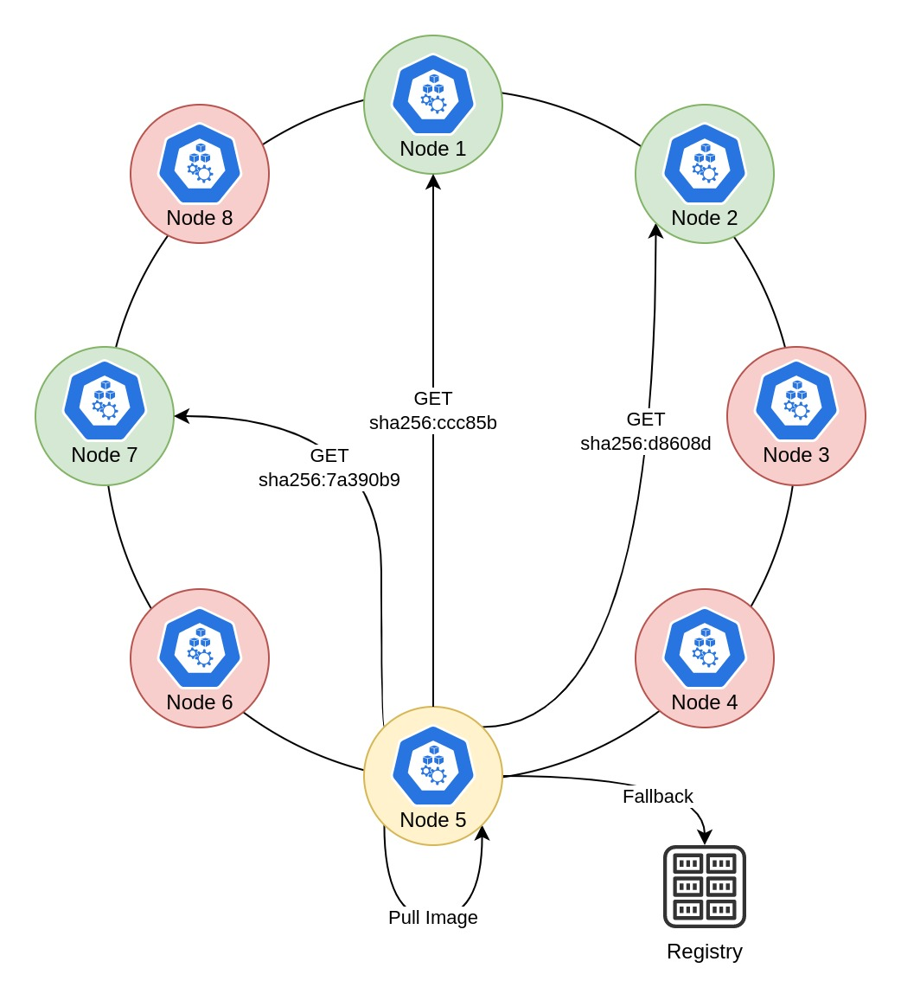
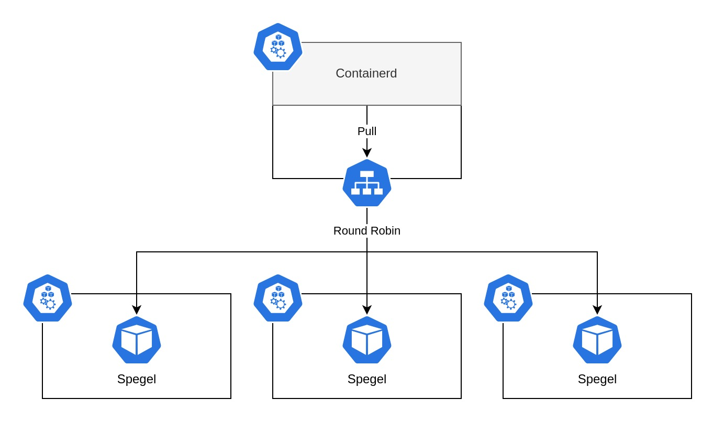

# Spegel

Spegel, mirror in Swedish, is a stateless cluster local OCI registry mirror.

## Background

Kubernetes does a great job at distributing workloads on multiple nodes. Allowing node failures to occur without affecting uptime. A critical component for this to work is that each node has to be able to pull the workload images before they can start. Each replica running on a node will incur a pull operation. The images may be pulled from geographically close registries within the cloud provider, public registries, or self-hosted registries. This process has a flaw in that each node has to make this round trip separately. Why can't the nodes share the image among themselves?

<p align="center">
  
</p>

Spegel enables all nodes in a Kubernetes cluster to act as a local registry mirror, allowing nodes to share images between themselves. Any image already pulled by a node will be available for any other node in the cluster to pull.

This has the benefit of reducing workload startup times and egress traffic as images will be stored locally within the cluster. On top of that it allows the scheduling of new workloads even when external registries are down.

## Prerequisite

Spegel relies on [containerd registry mirroring](https://github.com/containerd/containerd/blob/main/docs/hosts.md#cri) to route requests to the correct destination. It is capable of writing the mirror configuration on startup, as it is loaded on the fly by containerd.
It is however not capable of setting the registry mirror `config_path` in the containerd configuration as it requires a restart of containerd for the change to be picked up.

Spegel has been verified with AKS and EKS as they come with the expected configuration out of the box. Any other Kuberentes deployment should make the following configuration change to containerd.

```toml
version = 2

[plugins."io.containerd.grpc.v1.cri".registry]
   config_path = "/etc/containerd/certs.d"
```

## Installation

Easiest method to install Spegel is with the [Helm Chart](./charts/spegel).

```shell
kubectl create namespace spegel
helm upgrade --install --version <version> spegel oci://ghcr.io/xenitab/helm-charts/spegel
```

## Architecture

Spegel depends on being able to pull the Spegel image for it to work. When a new node is created in the cluster a Spegel Pod will be scheduled resulting in the node pulling the image.
This has a drawback in that Spegel will not be able to start on a new node if the registry it is pulled from is not available. The simplest solution to this problem is to pre-pull the image when building the machine image. That way the Spegel image will always be present on every new node.
The downside is that a new machine image needs to be built for every new Spegel version. Additionally, it requires the Kubernetes cluster to support custom machine images, something that is not possible on all cloud providers.

Spegel offers an alternative solution to the static nature of pre-pulling the image, by configuring a temporary mirror configuration before Spegel needs to be pulled that uses a node port service to reach another Spegel instance. When the Spegel image is pulled the request will be directed to a random Spegel instance. This is possible because the Spegel image has to be present on the receiving node for Spegel to run in the first place.
After the Spegel image is pulled the application will start and replace the mirror configuration written to bootstrap Spegel.

<p align="center">
  
</p>

Bootstrapping Spegel from itself also has the benefit of never having to pull Spegel from the public internet, unless Spegel itself is being updated. Even in the updating case the image will only need to be fetched once and will then be shared with the other new instances.
Bootstrapping is not enabled by default as it currently requires some user input to work properly. It is however highly recommended to enable this feature as it makes clusters for the most part immune to registry failures as long as the required image is stored within the cluster.
There are currently two methods to enable the bootstrap method. Either through the use of init containers or through modifying the VM template used to create the node.  

### Init Container

Using an init container to write the bootstrap mirror config to the host file system is probably the simplest method. It does however have the drawback that the init container itself requires an image to run. The image used needs `sh`, `mkdir`, and `cp` in it. Most Kubernetes solutions today tend to already bake images into the nodes machine image to speed up startup time. A good idea is to use one of these images for the init container. 

AKS users should refer to the [AKS VHD Notes](https://github.com/Azure/AKS/tree/master/vhd-notes/aks-ubuntu) for their specific OS type. The documentation contains a list of images that will always be present on the node. A good idea is to use the `mcr.microsoft.com/aks/command/runtime` image as it is already used to run commands inside of AKS.

EKS users should refer to the [EKS AMI](https://github.com/awslabs/amazon-eks-ami) repository for more information. It is currently not clear if any images are by default baked into the AMI. One option would be to use a custom AMI and pull a specific image when building the AMI.

Enabling the bootstrap init container is simple when installing Spegel with the Helm chart. All that is required is to set the image which will be used in the init container and enable both the init container and service features.

```yaml
bootstrap:
  service:
    enabled: true
  initContainer:
    enabled: true
    image:
      repository: "mcr.microsoft.com/aks/command/runtime"
      tag: "master.220211.1"
```

### VM Template

Modifying the VM template may be the cleaner method of solving the bootstrap problem, as it does not rely on an image always present on the node. Instead of having an init container write the mirror configuration, it is written to the host path as part of building the machine image, meaning the mirror configuration will be present immediatly on startup.

Modifying the VM template may be the cleaner method of solving the bootstrap problem, as it does not rely on an image always present on the node. Instead of having an init container write the mirror configuration, it is written to the host path as part of building the machine image, meaning the mirror configuration will be present immediatly on startup.

For this to work you need to write you own Containerd mirror configuration. By default the Spegel image is fetched from ghcr.io so that is what this example is going to use. If you have chosen to copy the image to another registry you will need to change the example accordingly.

```toml
server = "https://ghcr.io"

[host."http://127.0.0.1:30000"]
  capabilities = ["pull", "resolve"]
[host."http://127.0.0.1:30000".header]
  X-Spegel-Registry = ["https://ghcr.io"]
  X-Spegel-Mirror = ["false"]
```

Make sure to enable the bootstrap service when installing Spegel.

```yaml
bootstrap:
  service:
    enabled: true
```

## License

This project is licensed under the MIT License - see the [LICENSE](LICENSE) file for details.
