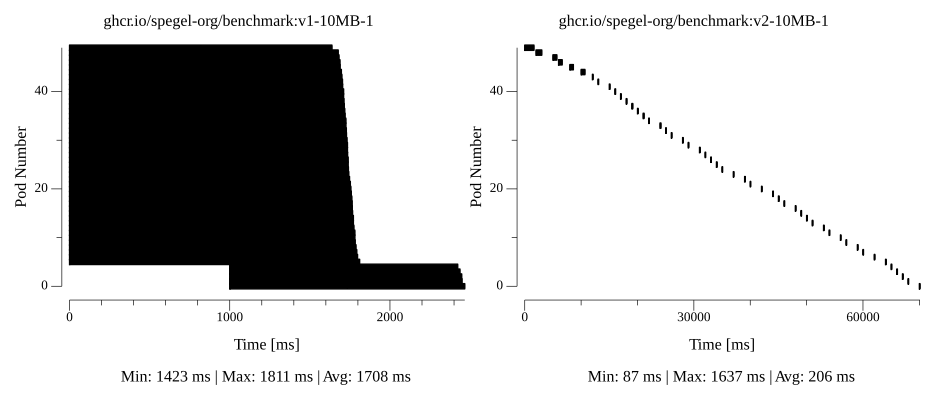
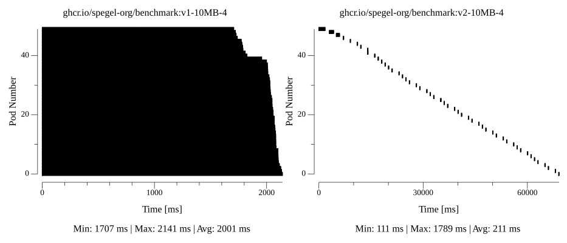
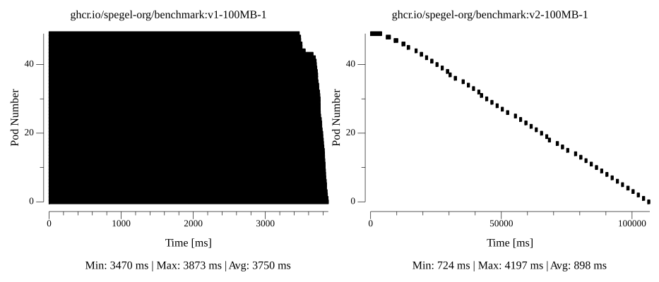
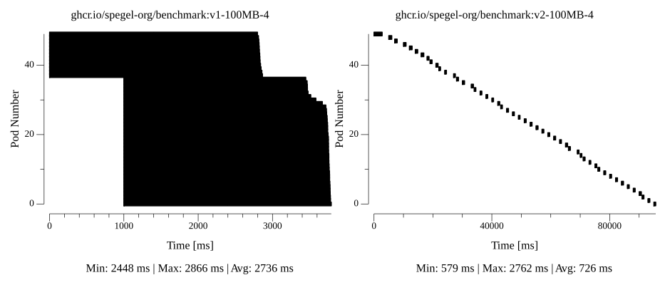
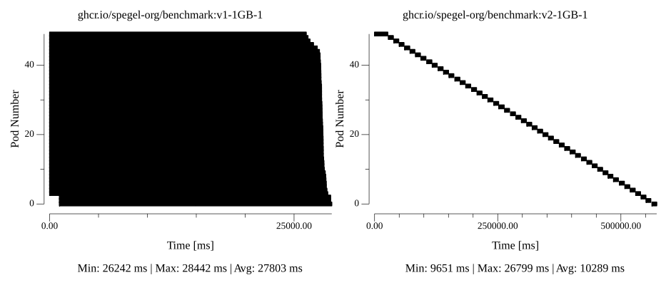
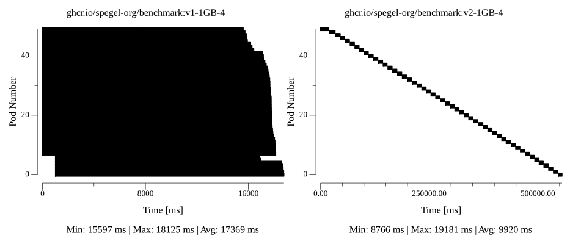

# Benchmark

Spegel performance is measured using the [Benchmark tool](https://github.com/spegel-org/benchmark) to give an idea of the expected performance that Spegel can deliver. The tool enables a generic method of measuring image pull performance using different deployment conditions in Kubernetes.

## Method

The benchmarks were run on AKS v1.29 with 50 `Standard_D4ds_v5` nodes. The environment was setup using the provided [Terraform configuration](https://github.com/spegel-org/benchmark/tree/main/terraform). Spegel v0.0.27 is installed in the cluster using the default configuration.

The measurements are done using the generated [benchmark images](https://github.com/spegel-org/benchmark/pkgs/container/benchmark). These images are provided as a v1 and v2 to simulate a rolling upgrade.

* 10 MB 1 layer
* 10 MB 4 layers
* 100 MB 1 layer
* 100 MB 4 layers
* 1 GB 1 layer
* 1 GB 4 layers

The measurements for 10 MB 1 layer is run with the following command. The same measurement is done for each of the image size and layer combinations.

```shell
benchmark measure --result-dir $RESULT_DIR --kubeconfig $KUBECONFIG --namespace spegel-benchmark --images ghcr.io/spegel-org/benchmark:v1-10MB-1 ghcr.io/spegel-org/benchmark:v2-10MB-1
```

Afterwards all of the results are analyzed to generate corresponding graphs.

```shell
benchmark analyze --path $RESULT
```

## Results

The results are compared to the [baseline results](https://github.com/spegel-org/benchmark/tree/main/results) which have been measured with the same setup but without Spegel running in the cluster.

| Image | Baseline | Spegel |
| --- | :---: | :---: | 
| 10 MB 1 layer |  |  |
| 10 MB 4 layer |  |  |
| 100 MB 1 layer |  |  |
| 100 MB 4 layer |  |  |
| 1 GB 1 layer |  |  |
| 1 GB 4 layer |  |  |

## Analysis

The image pull duration for v1 and v2 versions differ in shape. This is due to how Kubernetes rolls outs pods for new daemonsets compared to when one is updated. For the v1 images pods are created in batches with no check that the previous batch has started successfully. Images and it's layers are not advertised until the whole image has been pulled. When nodes pull the same image in parallel they will both fetch the image from the original registry. As the new batch of pods are created before the previous batch has pulled the image it means that they will also have to pull the image from the source registry. Batched pod creations is a known weakness of Spegel which does not have a solution currently. Any performance increase seen in the graphs are most likely coincidental due to the time at which the benchmarks were run. 

The v2 images however see a greater performance improvement as each pod will wait for the other to complete pulling the image. This means that the first pod will have to pull the image from the source registry. After that the second pod should be able to pull the image from the node which the first pod is deployed to. The table below shows the average pull duration for the baseline and Spegel benchmark. The improvement percentage is calculated with the equation `(baseline - spegel)/baseline * 100`. Images with multiple layers are faster than the the same sized images with singular layers. One explanation is that they benefit from layers being pulled in parallel.

| Image | Baseline (avg) | Spegel (avg) | Improvement |
| --- | --- | --- | --- |
| 10 MB 1 layer | 1220 ms | 210 ms | 81.25% |
| 10 MB 4 layers | 1409 ms | 155 ms | 88.99% |
| 100 MB 1 layer | 1725 ms | 560 ms | 67.53% |
| 100 MB 4 layers | 1573 ms | 500 ms | 68.21% |
| 1 GB 1 layer | 8429 ms | 6682 ms | 20.72% |
| 1 GB 4 layers | 7310 ms | 5125 ms | 29.89% |

While better the performance improvements get less as the images get larger. The best explanation is that the disk bandwidth is getting saturated. Spegel serves image layers from disk and relies on the OS to copy from disk to the TCP socket. Ignoring the overhead in discovering layers the next bottle neck is the network and disk bandwidth available. For the benchmark `Standard_D4ds_v5` VMs with ephemeral disk were used. These VMs have a non-guaranteed throughput of 250 MB/s. With some rough calculations we can see that `1024 MB / 4.392 s = 233 MB/s` which is approaching the max performance of the disk.  

## Conclusion

The benchmarks has shown that Spegel works best during updates of existing deployments and daemonsets rather than when new ones are created. Future work needs to be done in allowing advertisement of image pulls in progress to increase performance. It also shows that disk performance eventually matters when pulling large images. For this reason it could be beneficial to deploy larger VMs with higher disk throughput rather than more smaller VMs.
