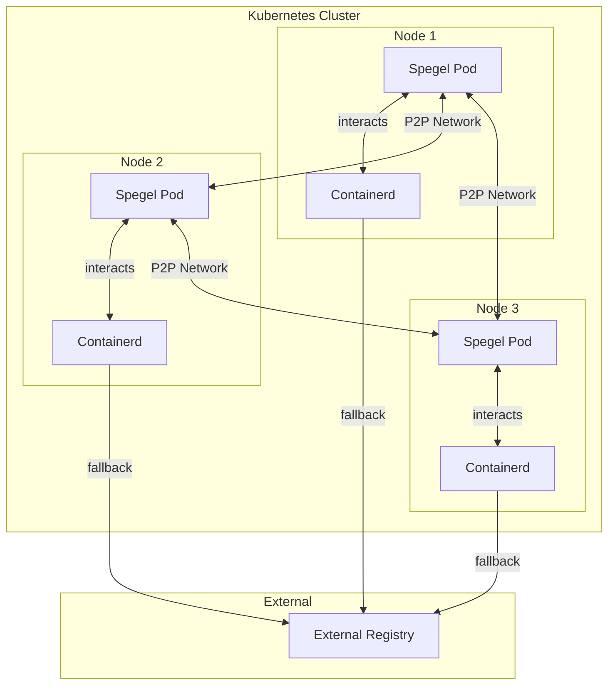
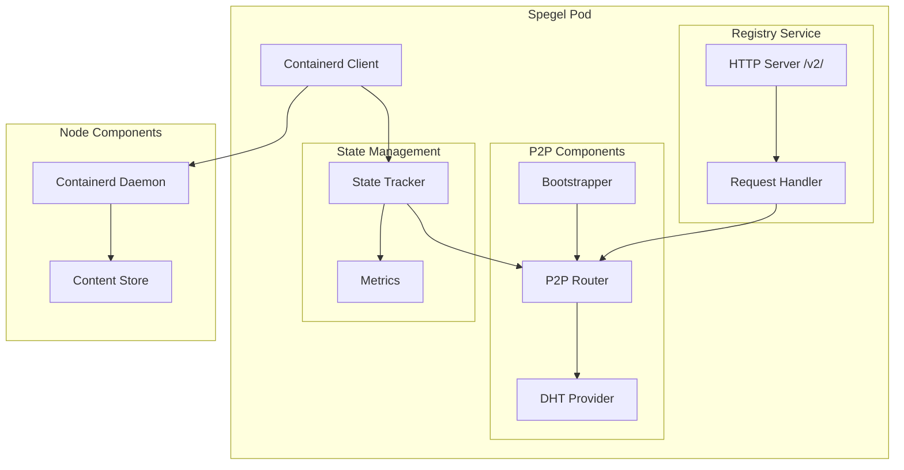
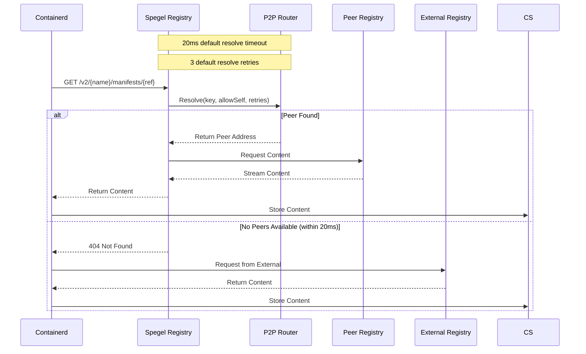
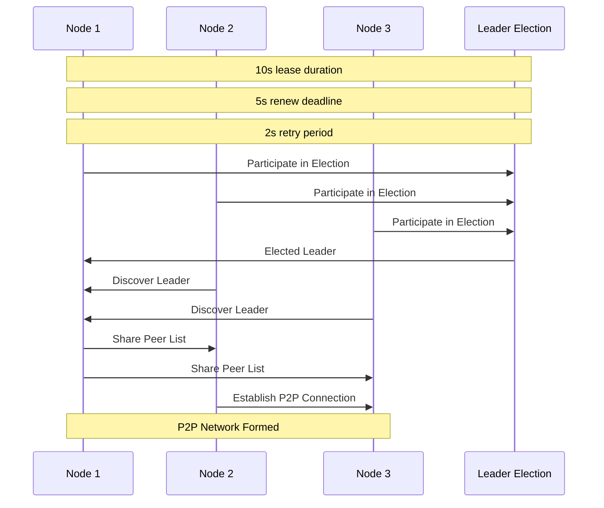
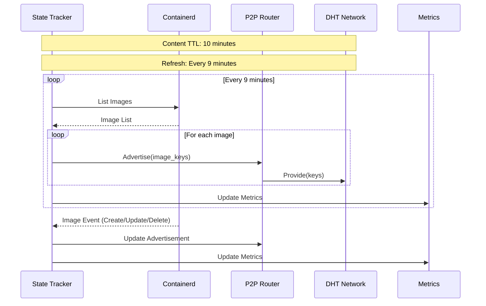
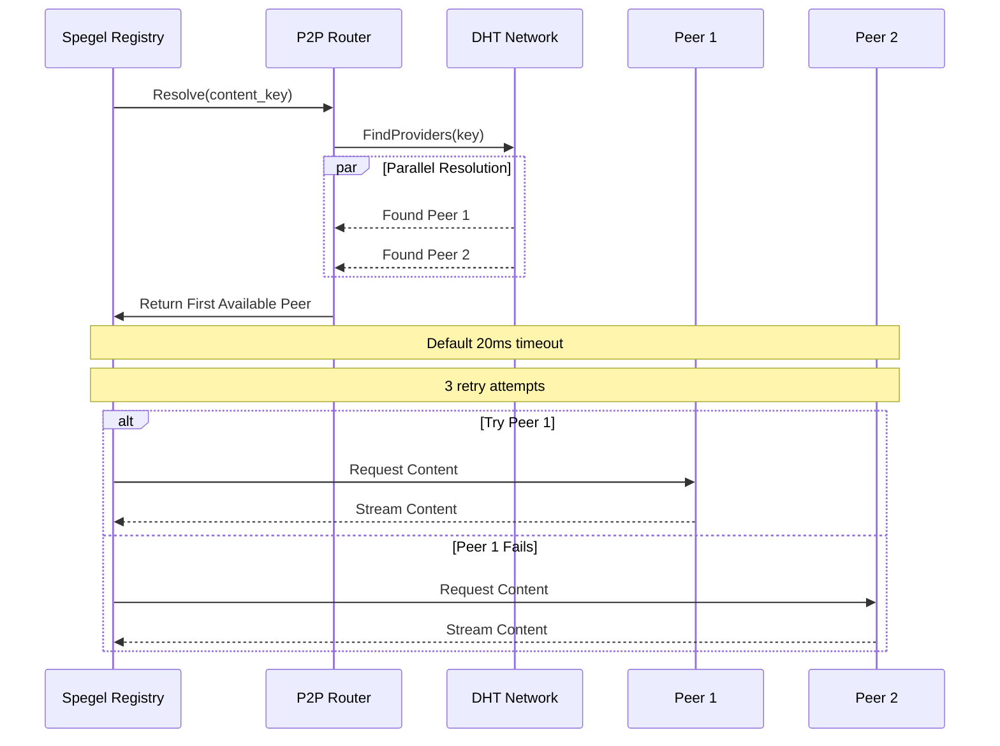
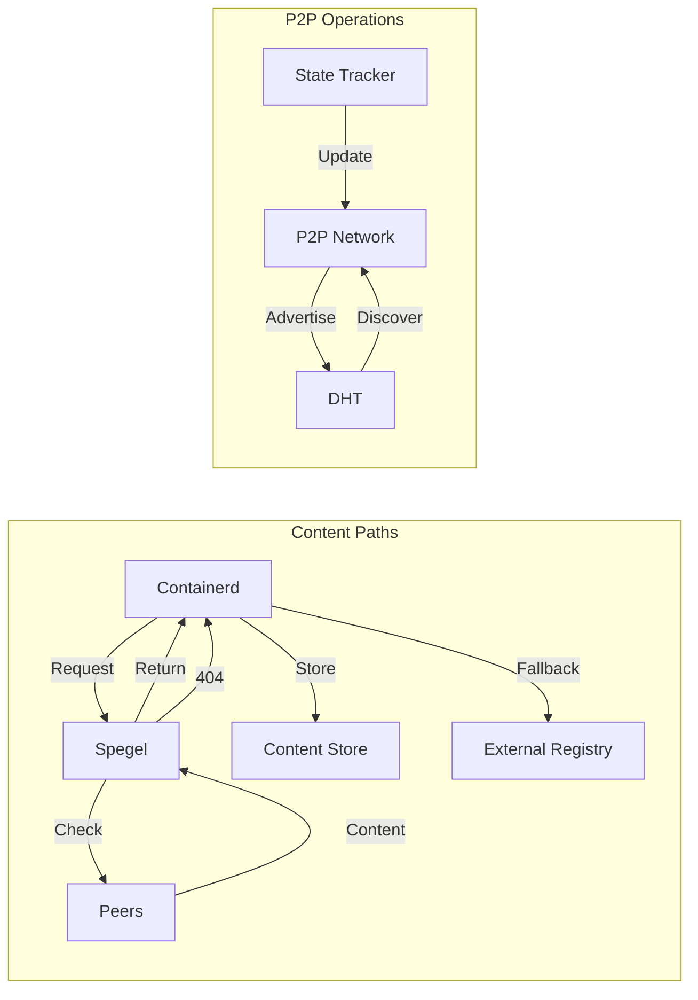
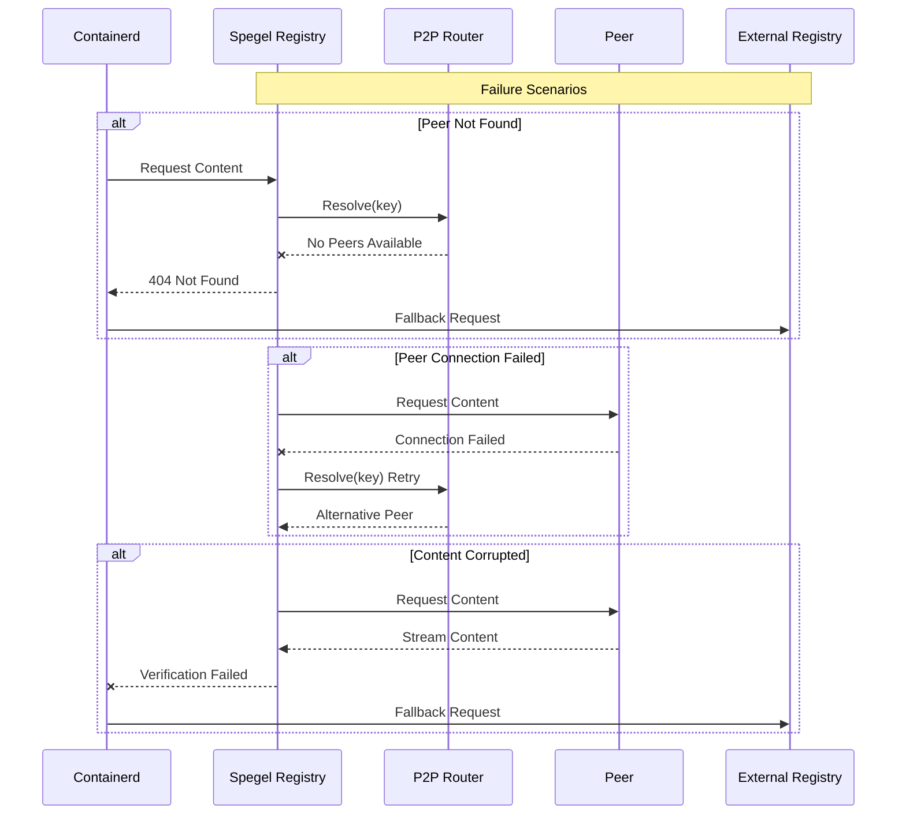
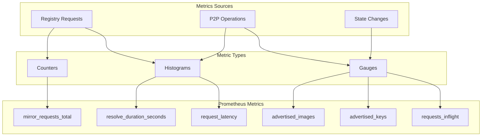

# Spegel: Visual Architecture Guide

This document provides a comprehensive set of diagrams explaining Spegel's architecture, flows, and operations.

## 1. High-Level Cluster Architecture

Shows how Spegel pods form a P2P network within the cluster. Containerd interacts with Spegel for image pulls and handles fallback to external registry when needed.

## 2. Pod Component Architecture

Details the internal components of a Spegel pod and their relationships, showing how the registry service, P2P components, and state management interact with each other and with containerd.

## 3. Image Pull Flow

Shows the sequence of operations during an image pull request, demonstrating both successful peer pulls and fallback to external registry.

## 4. P2P Network Formation

Shows how nodes discover each other and form the P2P network through leader election and peer sharing.

## 5. State Management and Content Advertisement

Shows how content availability is maintained and advertised in the P2P network, including periodic refresh cycles and event-driven updates.

## 6. Content Resolution Process

Shows how content is located and retrieved from peers in the network, including peer selection and retry mechanisms.

## 7. Data Flow Paths

Shows the content paths and system control flows, including peer transfers and fallback mechanisms.

## 8. Failure Handling

Shows how different types of failures are handled in the system.

## 9. Metrics Collection

Shows how metrics are collected and organized across the system components.

