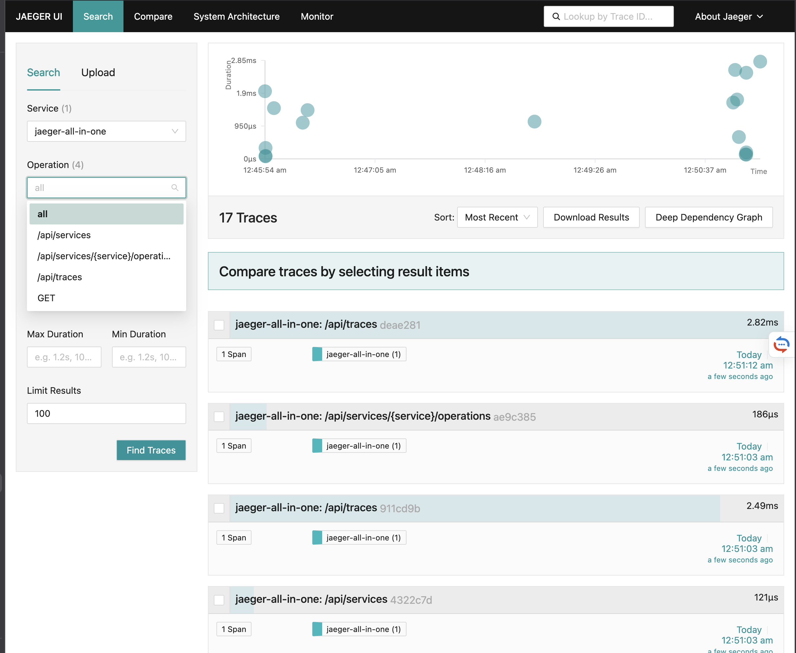
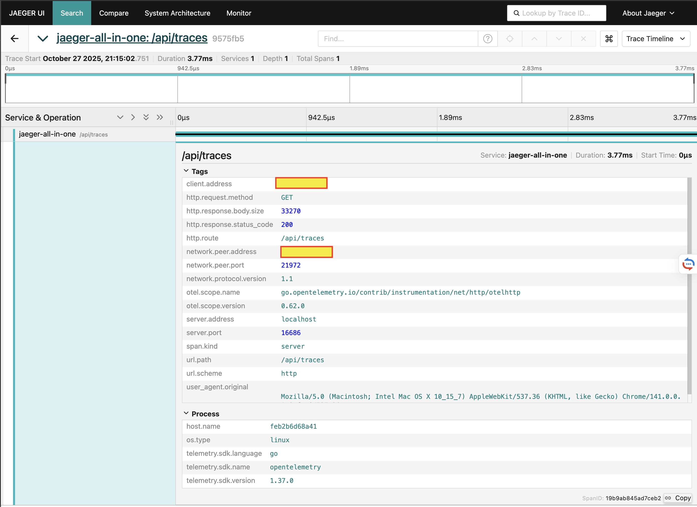

# OpenTelemetry quick start (local with Jaeger)

Minimal steps to see traces during development.

1) Start Jaeger (local OTLP receiver and UI)

```bash
docker compose -f docs/otel/docker-compose.otel.yaml up -d jaeger
```

2) Run Spegel with OTEL enabled (HTTP OTLP on 4318)

```bash
spegel registry \
  --otel-enabled \
  --otel-endpoint=http://localhost:4318 \
  --otel-service-name=spegel \
  --otel-sampler=always_on
```

3) View traces

Open <http://localhost:16686> and select service "spegel".

You should see traces in the search view:



Click on any trace to see detailed span information:



## Notes

- Build the code with the otel tag for unit tests: `go test -tags otel ./...`
- Helm users can set `.Values.spegel.otel.*` to enable OTEL in the chart.
